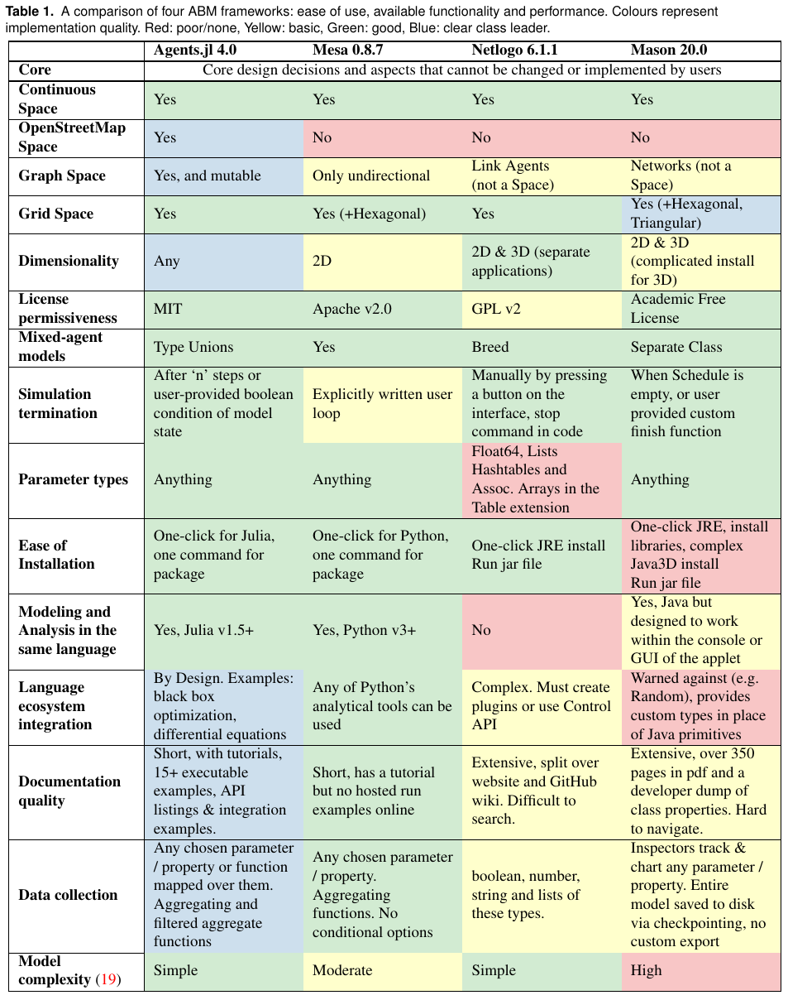
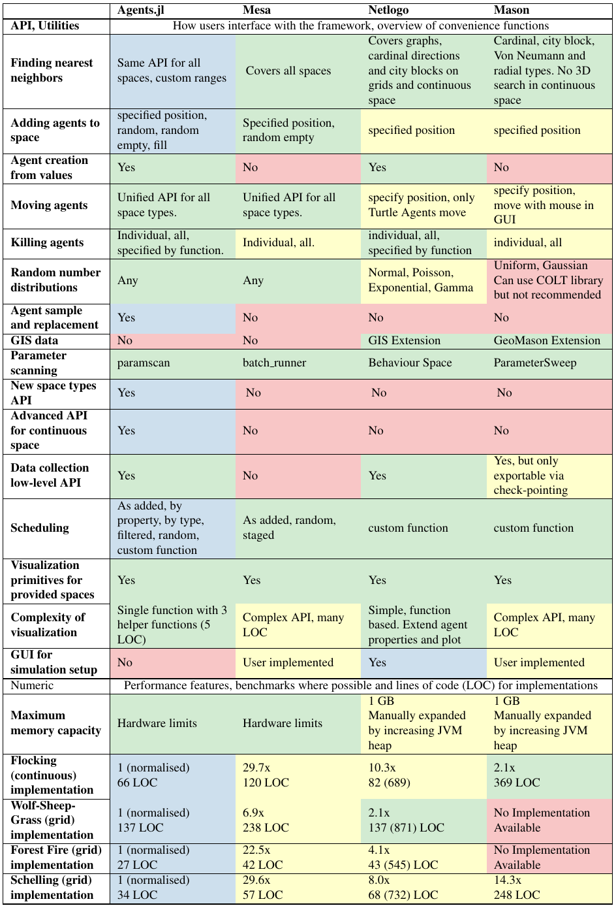

# ABM Framework Comparison
Many agent-based modeling frameworks have been constructed to ease the process of building and analyzing ABMs (see [here](http://dx.doi.org/10.1016/j.cosrev.2017.03.001) for a review).
Notable examples are [NetLogo](https://ccl.northwestern.edu/netlogo/), [Repast](https://repast.github.io/index.html), [MASON](https://journals.sagepub.com/doi/10.1177/0037549705058073), and [Mesa](https://github.com/projectmesa/mesa).

In this page we compare Agents.jl with Mesa, Netlogo and Mason, to assess where Agents.jl excels and also may need some future improvement.
We used the following models for the comparison:

- [Predator-prey dynamics](@ref) (Wolf Sheep Grass), a [`GridSpace`](@ref) model, which requires agents to be added, removed and moved; as well as identify properties of neighbouring positions.
- The [Flock model](@ref) (Flocking), a [`ContinuousSpace`](@ref) model, chosen over other models to include a MASON benchmark. Agents must move in accordance with social rules over the space.
- The [Forest fire model](@ref) (Forest Fire), provides comparisons for cellular automata type ABMs (i.e. when agents do not move). NOTE: The Agents.jl implementation of this model has been changed in v4.0 to be directly comparable to Mesa and NetLogo. As a consequence it no longer follows the [original rule-set](https://en.wikipedia.org/wiki/Forest-fire_model).
- [Schelling's-segregation-model](@ref) (Schelling), an additional [`GridSpace`](@ref) model to compare with MASON. Simpler rules than Wolf Sheep Grass.

The results are characterised in two ways: how long it took each model to perform the same scenario (initial conditions, grid size, run length etc. are the same across all frameworks), and how many lines of code (LOC) it took to describe each model and its dynamics. We use this result as a metric to represent the complexity of learning and working with a framework.

Time taken is presented in normalised units, measured against the runtime of Agents.jl. In other words: the results do not depend on any computers specific hardware. If one wishes to repeat the results personally by using the scripts in the [ABM_Framework_Comparisons](https://github.com/JuliaDynamics/ABM_Framework_Comparisons) repository: they will compute the same results. For details on the parameters used for each comparison, see the `benchmark.jl` file in that repository.

For LOC, we use the following convention: code is formatted using standard practices & linting for the associated language. Documentation strings and in-line comments (residing on lines of their own) are discarded, as well as any benchmark infrastructure. NetLogo is assigned two values since its files have a code base section and an encoding of the GUI. Since many parameters live in the GUI, we must take this into account. Thus `375 (785)` in a NetLogo count means 375 lines in the code section, 785 lines total in the file.

| Model/Framework | Agents 4.2 | Mesa 0.8| Netlogo 6.2 | MASON 20.0 |
|---|---|---|---|---|
|Wolf Sheep Grass|1|31.9x|10.3x|NA|
|(LOC)|122|227|137 (871)| . |
|Flocking|1|26.8x|10.3xᕯ|2.1x|
|(LOC)|62|102|82 (689)|369|
|Forest Fire|1|125.6x|53.0x|NA|
|(LOC)|23|35|43 (545)|.|
|Schelling|1|29.4x|8.0x|14.3x|
|(LOC)|31|56|68 (732)|248|

ᕯ Netlogo has a different implementation to the other three frameworks here. It cheats a little by only choosing one nearest neighbor in some cases rather than considering all neighbors within vision. So a true comparison would ultimately see a slower result.

The results clearly speak for themselves. Across all four models, Agents.jl's performance is exceptional whilst using the least amount of code. This removes many frustrating barriers-to-entry for new users, and streamlines the development process for established ones.

## Table-based comparison

In an our [paper discussing Agents.jl](https://arxiv.org/abs/2101.10072), we compiled a comparison over a large list of features and metrics from the four frameworks discussed above.
They are shown below in a table-based format:

