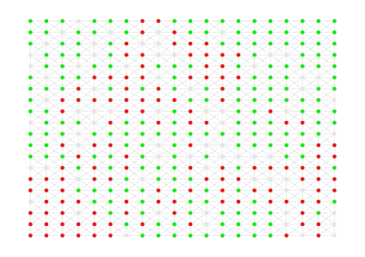
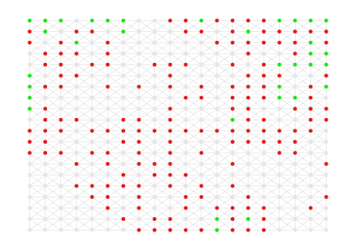
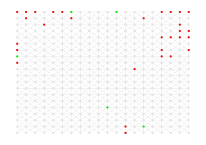

# Forest fire model

The model is defined as a cellular automaton on a grid with Ld cells. L is the side length of the grid and d is its dimension. A cell can be empty, occupied by a tree, or burning. The model of Drossel and Schwabl (1992) is defined by four rules which are executed simultaneously: 

1. A burning cell turns into an empty cell
1. A tree will burn if at least one neighbor is burning
1. A tree ignites with probability f even if no neighbor is burning
1. An empty space fills with a tree with probability p

The above explanation is from [Wikipedia](https://en.wikipedia.org/wiki/Forest-fire_model). Given that, we can build our model.

The complete code of this example is in the `examples/forest_fire.jl` file on the Github repository.

As usual, we define the agent, model, and space types. 

```julia
using Agents
using Random

mutable struct Tree{T<:Integer} <: AbstractAgent
  id::T
  pos::Tuple{T, T}
  status::Bool  # true is green and false is burning
end

mutable struct Forest{T<:AbstractSpace, Y<:AbstractVector, Z<:AbstractFloat} <: ABM
  space::T
  agents::Y
  scheduler::Function
  f::Z  # probability that a tree will ignite
  d::Z  # forest density
  p::Z  # probability that a tree will grow in an empty space
end

mutable struct MyGrid{T<:Integer, Y<:AbstractVector} <: AbstractSpace
  dimensions::Tuple{T, T}
  space::SimpleGraph
  agent_positions::Y  # an array of arrays for each grid node
end

```

The agent type `Tree` has three fields: `id` and `pos`, which have to be there for any model, and a `status` field that we introduce for this specific mode. The `status` field will hold `true` for a green tree and `false` for a burning one. All model parameters go to the model type `Forest` in addition to the compulsory `space`, `agents`, and `scheduler` fields. The space type has the three minimum fields.

We can now instantiate the model. It is a good idea to put the instantiate lines in a function so that it will be easy to restart the model and change its parameters.:

```julia
function model_initiation(;f, d, p, griddims, seed)
  Random.seed!(seed)
  # initialize the model
  # we start the model without creating the agents first
  agent_positions = [Array{Integer}(undef, 0) for i in 1:nv(griddims)]
  mygrid = MyGrid(griddims, grid(griddims, false, true), agent_positions)  # create a 2D grid where each node is connected to at most 8 neighbors.
  forest = Forest(mygrid, Array{Tree}(undef, 0), random_activation, f, d, p)

  # create and add trees to each node with probability d, which determines the density of the forest
  for node in 1:nv(forest.space.dimensions)
    pp = rand()
    if pp <= forest.d
      tree = Tree(node, (1,1), true)
      add_agent!(tree, node, forest)
    end
  end
  return forest
end
```

Note that to keep the simulation results repeatable, we include `Random.seed!(seed)`, so that the random number generator start from the same position everytime.

We should now make a step function. It maybe easier to randomly go through every node on the grid and decide what happens to the node depending on its state. If its empty, add a tree with probability `p`, if it has a burning tree, remove it from the node, and if it has a green tree with a burning neighbor, burn the tree. Doing this requires a step function for the model, not every single agent. A model step function only accepts a model type as its argument.

```julia
function forest_step!(forest)
  shuffled_nodes = shuffle(1:nv(forest.space.dimensions))
  for node in shuffled_nodes  # randomly go through the cells and 
    if length(forest.space.agent_positions[node]) == 0  # the cell is empty, maybe a tree grows here?
      p = rand()
      if p <= forest.p
        treeid = forest.agents[end].id +1
        tree = Tree(treeid, (1,1), true)
        add_agent!(tree, node, forest)
      end
    else
      treeid = forest.space.agent_positions[node][1]  # id of the tree on this cell
      tree = id2agent(treeid, forest)  # the tree on this cell
      if tree.status == false  # if it is has been burning, remove it.
        kill_agent!(tree, forest)
      else
        f = rand()
        if f <= forest.f  # the tree ignites on fire
          tree.status = false
        else  # if any neighbor is on fire, set this tree on fire too
          neighbor_cells = node_neighbors(tree, forest)
          for cell in neighbor_cells
            treeid = get_node_contents(cell, forest)
            if length(treeid) != 0  # the cell is not empty
              treen = id2agent(treeid[1], forest)
              if treen.status == false
                tree.status = false
                break
              end
            end
          end
        end
      end
    end
  end
end

```

That is all before we run the model. Because an agent step function is necessary for the built-in `step!` method, we use a dummy agent step function (`dummystep`) that accepts two arguments (one for the agent object and one for the model object).

```julia
# create the model
forest = model_initiation(f=0.1, d=0.8, p=0.1, griddims=(20, 20), seed=2)

# choose which agent properties you want to collect
agent_properties = [:status]

# what functions to apply to the chosen agent properties before collecting them. `length` will show the number of trees and `count` the number of green trees.
aggregators = [length, count]

# at which steps to collect the data
when = collect(1:100)

# Run the model for 100 steps
data = step!(dummystep, forest_step!, forest, 100, agent_properties, aggregators, when)

# explore data visually
visualize_data(data)
```

Alternatively, collect agent positions and plot them on a 2D grid

```julia
forest = model_initiation(f=0.05, d=0.8, p=0.01, griddims=(20, 20), seed=2)
agent_properties = [:status, :pos]
data = step!(dummystep, forest_step!, forest, 10, agent_properties, collect(1:10))
for i in 1:10
  visualize_2D_agent_distribution(data, forest, Symbol("pos_$i"), types=Symbol("status_$i"), savename="step_$i", cc=Dict(true=>"green", false=>"red"))
end
```

Step 1



Step 2



Step 3



```julia
# Optionally Run batch simulation
data = batchrunner(dummystep, forest_step!, forest, 10, agent_properties, aggregators, when, 10)

# And write the results to file
write_to_file(df=data, filename="forest_model.csv")
```