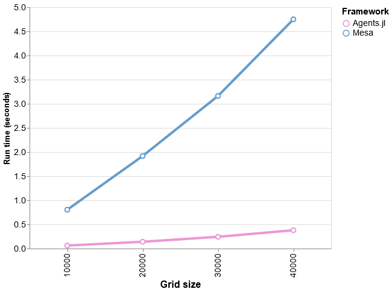
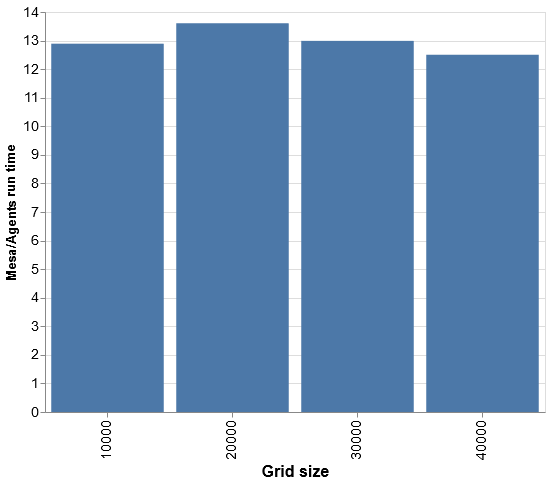

# Agents.jl vs Mesa: speed comparison

Julia code can run much faster than Python. And since Agents.jl is a minimal framework, an agent-based model written in Julia and using Agents.jl can be much faster than the same algorithm written in Python and using the Mesa package. Furthermore, Agents.jl has a considerably simpler API which reduces the learning curve. Mesa, on the other hand, is much stronger in visualizing the simulations.

Here is a benchmark of a version of the forest fire model implemented both in Agents.jl and in Mesa. This version of the model is simpler than the one in the `examples` folder. The Python implementation is taken from Mesa's Github page. The Julia implementation follows the same logic as the Python implementation. The code for both implementations is in the `test/benchmark/mesa` folder on Agents.jl's Github page.

Briefly, the model has two parameters: grid size and forest density. It initially plants trees on the grid given the density. Next, it sets trees on one edge of the forest on fire. During each iteration, neighboring trees to a tree on fire catch fire and those trees already on fire burn down. There is no growth of trees.

Figure below shows the time it takes for 100 iterations of a "forest fire" model with a density of 0.6 in Mesa and Agents.jl. The x-axis of the figure is different grid sizes. The model implemented in Agents.jl is up to more than 13 times faster than the model implemented in Mesa.

Here are the relative numbers:

