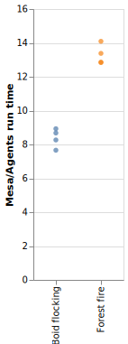

# Agents.jl vs Mesa: speed comparison

Julia code can run much faster than Python. And since Agents.jl is a minimal 
framework, an agent-based model written in Julia and using Agents.jl can be 
much faster than the same algorithm written in Python and using the Mesa 
package. Furthermore, Agents.jl has a considerably simpler API which reduces 
the learning curve. Mesa, on the other hand, is much stronger in visualizing 
the simulations.

Here is a benchmark of two models, forest fire and boid flocking,
implemented in Agents.jl and Mesa 
(code is available in `test/benchmark/mesa` folder on Agents.jl's Github page).
We took the Python implementations from Mesa's Github page.
The Julia implementations follow the same logic as the Python implementations.
We tested a range of grid sizes and population sizes for the forest fire the boid flocking models, respectively, hence the multiple points.

Figure below shows the ratio of the time it takes to run the models in Mesa
over the time it takes to run them in Agents.jl. The model implemented in 
Agents.jl is up to more than 14 times faster than the model implemented in Mesa
for the forest fire model and about 9 times faster for the boid flocking.

