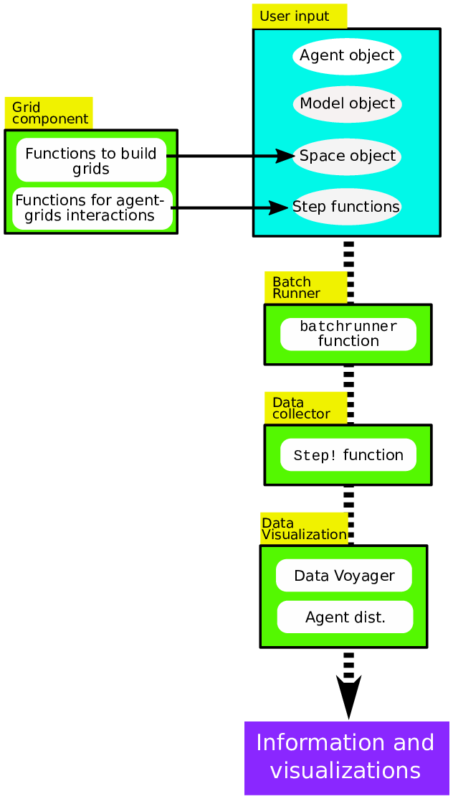

# Tutorial

## Agents.jl's basic usage

Agents.jl is composed of components for building models, building and managing space structures, collecting data, running batch simulations, and data visualization.

Agents.jl structures simulations in three components: a _model_ component that keeps all model-level variables and data, an _agent_ component that keeps all agent-level variables and data, and a _space_ component that represents the space where the agents live.

For building any ABM, users have to define at least the following four quantities:
1. A `struct` for the model.
2. A `struct` for the agents.
3. A `Space` instance.  
4. A stepping function that controls how the agents and the model evolve.

With these, Agents.jl's tools manage the rest of the path to producing and processing data, as well as visualizations (Fig. 1).



### The model
```@docs
ABM
```
The model type may not necessarily be a mutable type, it depends on your problem.
## The space
Under the hood, all spaces are represented by a graph from LightGraphs.jl.
However, if your space is a regular grid then there is some additional functionality that allows converting graph nodes to coordinates on the multidimensional grid.

Regardless, in every case you initialize your space by calling `Space`:
```@docs
Space
```
### The agent
```@docs
AbstractAgent
```
The agent type **must** be mutable. Once an Agent is created it can be added to a model using e.g.
```@docs
add_agent!
add_agent_single!
```
Then, the agent can interact with the model and the space further by using
```@docs
move_agent!
move_agent_single!
kill_agent!
```
For more functions visit the [Built-in functions](@ref) page.

### The stepping function
Any ABM model should have at least one and at most two step functions.
An _agent step function_ is always required.
Such an agent step function defines what happens to an agent when it activates.
Sometimes we also need a function that changes all agents at once, or changes a model property. In such cases, we can also provide a _model step function_.

An agent step function should only accept two arguments: first, an agent object, and second, a model object.

The model step function should accept only one argument, that is the model object.
To use only a model step function, users can use the built-in `dummystep` as the agent step function.

### Running the model & collecting data

After the basic types and functions are defined, we can run the model using the built-in `step!` function. This will update the agents and the model as defined by the agent and model stepping functions.
In addition, by providing keywords to `step!`, it is also possible to collect and process data while the model evolves.
```@docs
Agents.step!
```


## Example: Schelling's segregation model

We now demonstrate Agents.jl's architecture and features through building the following definition of Schelling's segregation model:

* Agents belong to one of two groups (0 or 1).
* The agents leave in a two-dimensional Moore grid (8 neighbors per node).
* If an agent is in the same group with at least three neighbors, then it is happy.
* If an agent is unhappy, it keeps moving to new locations until it is happy.

### Defining the agent type
```@example schelling
using Agents

mutable struct SchellingAgent <: AbstractAgent
  id::Int # The identifier number of the agent
  pos::Tuple{Int,Int} # The x, y location of the agent
  mood::Bool # whether the agent is happy in its node. (true = happy)
  group::Int # The group of the agent,
             # determines mood as it interacts with neighbors
end
```
Notice that the position of this Agent type is a `Tuple{Int,Int}` because we will use a grid `Space`.

We added two more fields for this model, namely a `mood` field which will store `true` for a happy agent and `false` for an unhappy one, and an `group` field which stores `0` or `1` representing two groups.


### Defining the model type
```@example schelling
mutable struct SchellingModel{S, F} <: ABM
  scheduler::F
  space::S
  agents::Vector{SchellingAgent}
  min_to_be_happy::Int # minimum number of neighbors for agent to be happy
end
```

We add the minimum number of neighbors of the same kind for an agent to be happy as a field of the model (`min_to_be_happy`).

### Instantiating the model

Now that we have defined the basic structs, we should instantiate the model.
We put the model instantiation in a function so that it will be easy to recreate the model and change its parameters.

For the schedulling function in this example we will use the provided [`random_activation`](@ref).

```@example schelling
"Function to instantiate the model."
function instantiate(;numagents=320, griddims=(20, 20), min_to_be_happy=3)
    space = Space(griddims, moore = true) # make a Moore grid
    # use random_activation function from Agents.jl and the argument min_to_be_happy
    # give the model an empty list of agents, as they will be added incrementally
    model = SchellingModel(random_activation, space, SchellingAgent[], min_to_be_happy)
    # populate the model with agents, adding equal amount of the two types of agents
    # at random positions in the model
    for n in 1:numagents
        agent = SchellingAgent(n, (1,1), false, n < numagents/2 ? 1 : 2)
        add_agent_single!(agent, model)
    end
    return model
end
```
Notice that the position that an agent is initialized does not matter.
Both of them are set properly when adding an agent to the model.

Explanations below correspond to the numbered lines in the code snippet above:

1. Creates an array of empty arrays as many as there are agents.
2. Creates a 2D grid with nodes that have Moore neighborhoods. The grid does not have periodic edges.
3. Instantiates the model. It uses an empty array for `agents`.
4. Creates an array of agents with two different groups. All agents have a temporary coordinate of (1, 1).
5. Adds agents to random nodes in space and to the `agents` array in the model object. `add_agent_single!` ensures that there are no more than one agent per node.

### Defining a step function

Finally, we define a _step_ function to determine what happens to an agent when activated.

```@example schelling
function agent_step!(agent, model)
  if agent.mood == true
    return
  end
  while agent.mood == false
    neighbor_cells = node_neighbors(agent, model)
    count_neighbors_same_group = 0

    # For each neighbor, get group and compare to current agent's group...
    # ...and increment count_neighbors_same_group as appropriately.
    for neighbor_cell in neighbor_cells
      node_contents = get_node_contents(neighbor_cell, model)
      # Skip iteration if the node is empty.
      length(node_contents) == 0 && continue
      # Otherwise, get the first agent in the node...
      agent_id = node_contents[1]
      # ...and increment count_neighbors_same_group if the neighbor's group is
      # the same.
      neighbor_agent_group = model.agents[agent_id].group
      if neighbor_agent_group == agent.group
        count_neighbors_same_group += 1
      end
    end

    # After counting the neighbors, decide whether or not to move the agent.
    # If count_neighbors_same_group is at least the min_to_be_happy, set the
    # mood to true. Otherwise, move the agent using move_agent_single.
    if count_neighbors_same_group ≥ model.min_to_be_happy
      agent.mood = true
    else
      move_agent_single!(agent, model)
    end
  end
  return
end

happyperc(model) = count(x -> x.mood == true, model.agents)/nagents(model)
```

For the purpose of this implementation of Schelling's segregation model, we only need an agent step function.

For defining `agent_step!` we used some of the built-in functions of Agents.jl, such as [`node_neighbors`](@ref) that returns the neighboring nodes of the node on which the agent resides, [`get_node_contents`](@ref) that returns the IDs of the agents on a given node, and [`move_agent_single!`](@ref) which moves agents to random empty nodes on the grid. A full list of built-in functions and their explanations are available [Built-in functions](@ref) page.

### Running the model
```@example schelling
# Instantiate the model with 370 agents on a 20 by 20 grid.
model = instantiate(numagents=370, griddims=(20,20), min_to_be_happy=3)
step!(model, agent_step!)  # Run the model one step...
step!(model, agent_step!, 3)  # ...run the model 3 steps.
```

### Running the model and collecting data

We can use the same `step!` function with more arguments to run multiple steps and collect values of our desired fields from every agent and put these data in a `DataFrame` object.

```@example schelling
# Instantiate the model with 370 agents on a 20 by 20 grid.
model = instantiate(numagents=370, griddims=(20,20), min_to_be_happy=3)
# An array of Symbols for the agent fields that are to be collected.
properties = [:pos, :mood, :group]
# Specifies at which steps data should be collected.
when = collect(1:2)
# Use the step function to run the model and collect data into a DataFrame.
data = step!(model, agent_step!, 2, properties, when=when)
```

`properties` is an array of [`Symbols`](https://pkg.julialang.org/docs/julia/THl1k/1.1.1/manual/metaprogramming.html#Symbols-1) for the agent fields that we want to collect. `when` specifies at which steps data should be collected.

### Visualizing the data

We can use the `visualize_2D_agent_distribution` function to plot the distribution of agents on a 2D grid at every generation (Fig. 1):

```julia
# Use the visualize_2D_agent_distribution function from AgentPlots.jl to plot distribution of agents at every step.
using AgentPlots

for i in 1:2
  visualize_2D_agent_distribution(data, model, Symbol("pos_$i"),
  types=Symbol("group_$i"), savename="step_$i", cc=Dict(1=>"blue", 2=>"red"))
end
```

The first and second arguments of the `visualize_2D_agent_distribution` are the `data` and the `model` objects. The third argument is the column name in `data` that has the position of each agent. The fourth argument is the column name in `data` that stores agents'  groups. `savename` is the name of the plot file. `cc` is a dictionary that defines the colors of each agent group.

Custom plots can be easily made with [`DataVoyager`](https://github.com/queryverse/DataVoyager.jl) because the outputs of simulations are always as a `DataFrame` object.

```jl
using DataVoyager
v = Voyager(data)
```
