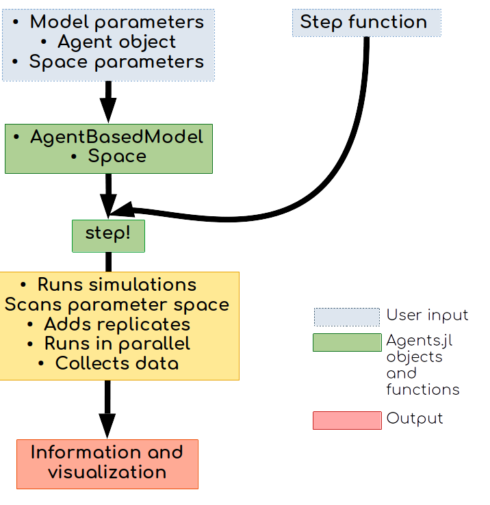
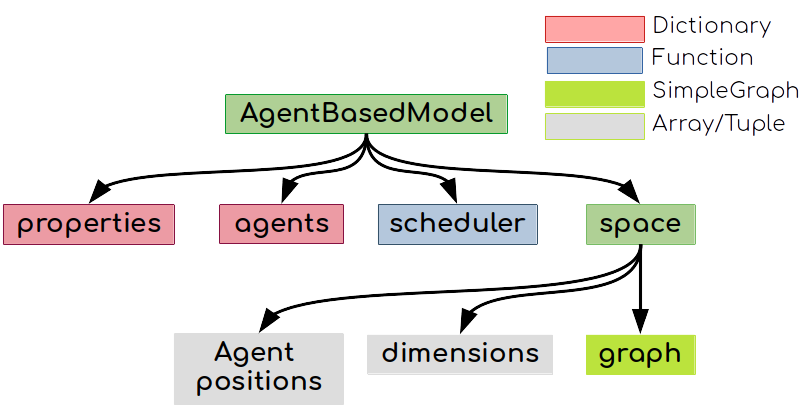

# Tutorial

## Agents.jl's basic usage

Agents.jl is composed of components for building models, building and managing space structures, collecting data, running batch simulations, and data visualization.

Agents.jl structures simulations in three components: a _model_ component that keeps all model-level variables and data, an _agent_ component that keeps all agent-level variables and data, and a _space_ component that represents the space where the agents live.

For building any Agent-Based-Model (ABM), users have to define at least the following four quantities:

1. An [`AgentBasedModel`](@ref) instance.
1. A [`Space`](@ref) instance.  
1. A subtype of [`AbstractAgent`](@ref) for the agents.
1. A stepping function that controls how the agents and the model evolve.

With these, Agents.jl's tools manage the rest of the path to producing and processing data, as well as visualizations (Fig. 1).



-----



### 1. The model

```@docs
AgentBasedModel
```

The model type may not necessarily be a mutable type, it depends on your problem.

### 2. The space

Under the hood, all spaces are represented by a graph from LightGraphs.jl.
However, if your space is a regular grid then there is some additional functionality that allows converting graph nodes to coordinates on the multidimensional grid.

Regardless, in every case you initialize your space by calling `Space`:

```@docs
Space
```

### 3. The agent

```@docs
AbstractAgent
```

The agent type **must** be mutable. Once an Agent is created it can be added to a model using e.g. [`add_agent!`](@ref).
Then, the agent can interact with the model and the space further by using
e.g. [`move_agent!`](@ref) or [`kill_agent!`](@ref).

For more functions visit the [API](@ref) page.

### 4. The stepping function

Any ABM model should have at least one and at most two step functions.
An _agent step function_ is always required.
Such an agent step function defines what happens to an agent when it activates.
Sometimes we also need a function that changes all agents at once, or changes a model property. In such cases, we can also provide a _model step function_.

An agent step function should only accept two arguments: first, an agent object, and second, a model object.

The model step function should accept only one argument, that is the model object.
To use only a model step function, users can use the built-in `dummystep` as the agent step function.

### 5. Running the model & collecting data

After the basic types and functions are defined, we can run the model using the built-in `step!` function. This will update the agents and the model as defined by the agent and model stepping functions.
In addition, by providing keywords to `step!`, it is also possible to collect and process data while the model evolves.

```@docs
Agents.step!
```

---

Notice that besides `step!`, there is also the [`paramscan`](@ref) function that performs data collection, see below.

## Example: Schelling's segregation model

We now demonstrate Agents.jl's architecture and features through building the following definition of Schelling's segregation model:

* Agents belong to one of two groups (0 or 1).
* The agents leave in a two-dimensional Moore grid (8 neighbors per node).
* If an agent is in the same group with at least three neighbors, then it is happy.
* If an agent is unhappy, it keeps moving to new locations until it is happy.

Schelling's model shows that even small preferences of agents to have neighbors belonging to the same group (e.g. preferring that at least 30% of neighbors to be in the same group) could lead to total segregation of neighborhoods.

### Defining the agent type

```@example schelling
using Agents

mutable struct SchellingAgent <: AbstractAgent
  id::Int # The identifier number of the agent
  pos::Tuple{Int,Int} # The x, y location of the agent
  mood::Bool # whether the agent is happy in its node. (true = happy)
  group::Int # The group of the agent,
             # determines mood as it interacts with neighbors
end
```

Notice that the position of this Agent type is a `Tuple{Int,Int}` because we will use a grid `Space`.

We added two more fields for this model, namely a `mood` field which will store `true` for a happy agent and `false` for an unhappy one, and an `group` field which stores `0` or `1` representing two groups.

### Creating a space

For this example, we will be using a Moore 2D grid, e.g.

```@example schelling
space = Space((10,10), moore = true)
```

### Creating an ABM

To make our model we follow the instructions of [`AgentBasedModel`](@ref).
We also want to include a property `min_to_be_happy` in our model, and so we have:

```@example schelling
properties = Dict(:min_to_be_happy => 3)
schelling = ABM(SchellingAgent, space; properties = properties)
```

Here we used the default scheduler.

### Creating the ABM through a function

Here we put the model instantiation in a function so that it will be easy to recreate the model and change its parameters.

In addition, inside this function, we populate the model with some agents.
We also change the scheduler to [`random_activation`](@ref).
Because the function is defined based on keywords, it will be of further use in [`paramscan`](@ref) below.

```@example schelling
function initialize(;numagents=320, griddims=(20, 20), min_to_be_happy=3)
    space = Space(griddims, moore = true) # make a Moore grid
    properties = Dict(:min_to_be_happy => 3)
    model = ABM(SchellingAgent, space; properties=properties, scheduler = random_activation)
    # populate the model with agents, adding equal amount of the two types of agents
    # at random positions in the model
    for n in 1:numagents
        agent = SchellingAgent(n, (1,1), false, n < numagents/2 ? 1 : 2)
        add_agent_single!(agent, model)
    end
    return model
end
```
Notice that the position that an agent is initialized does not matter.
This is because it is set properly when adding an agent to the model.

### Defining a step function

Finally, we define a _step_ function to determine what happens to an agent when activated.

```@example schelling
function agent_step!(agent, model)
    agent.mood == true && return # do nothing if already happy
    minhappy = model.properties[:min_to_be_happy]
    neighbor_cells = node_neighbors(agent, model)
    count_neighbors_same_group = 0
    # For each neighbor, get group and compare to current agent's group
    # and increment count_neighbors_same_group as appropriately.
    for neighbor_cell in neighbor_cells
        node_contents = get_node_contents(neighbor_cell, model)
        # Skip iteration if the node is empty.
        length(node_contents) == 0 && continue
        # Otherwise, get the first agent in the node...
        agent_id = node_contents[1]
        # ...and increment count_neighbors_same_group if the neighbor's group is
        # the same.
        neighbor_agent_group = model.agents[agent_id].group
        if neighbor_agent_group == agent.group
            count_neighbors_same_group += 1
        end
    end
    # After counting the neighbors, decide whether or not to move the agent.
    # If count_neighbors_same_group is at least the min_to_be_happy, set the
    # mood to true. Otherwise, move the agent to a random node.
    if count_neighbors_same_group ≥ minhappy
        agent.mood = true
    else
        move_agent_single!(agent, model)
    end
    return
end
```

For the purpose of this implementation of Schelling's segregation model, we only need an agent step function.

For defining `agent_step!` we used some of the built-in functions of Agents.jl, such as [`node_neighbors`](@ref) that returns the neighboring nodes of the node on which the agent resides, [`get_node_contents`](@ref) that returns the IDs of the agents on a given node, and [`move_agent_single!`](@ref) which moves agents to random empty nodes on the grid. A full list of built-in functions and their explanations are available in the [API](@ref) page.

### Running the model

```@example schelling
# initialize the model with 370 agents on a 20 by 20 grid.
model = initialize()
step!(model, agent_step!)     # run the model one step
step!(model, agent_step!, 3)  # run the model 3 steps.
```

### Running the model and collecting data

We can use the same [`step!`](@ref) function with more arguments to run multiple steps and collect values of our desired fields from every agent and put these data in a `DataFrame` object.

```@example schelling
model = initialize()
# An array of Symbols for the agent fields that are to be collected.
properties = [:pos, :mood, :group]
# Specifies at which steps data should be collected.
n = 5  # number of time steps to run the simulation
when = 1:n  # At which steps to collect data
# Use the step function to run the model and collect data into a DataFrame.
data = step!(model, agent_step!, n, properties, when=when)
data[1:10, :] # print only a few rows
```

`properties` is an array of [`Symbols`](https://pkg.julialang.org/docs/julia/THl1k/1.1.1/manual/metaprogramming.html#Symbols-1) for the agent fields that we want to collect. `when` specifies at which steps data should be collected.

With the above `properties` vector, we collected all agents data. We can instead only collected aggregated data. For example, let's only get the number of happy individuals:

```@example schelling
model = initialize(numagents=370, griddims=(20,20), min_to_be_happy=3);
properties = Dict(:mood => [sum])
n = 5; when = 1:n
data = step!(model, agent_step!, 5, properties, when=when)
```

In the `Examples` pages there are more realistic examples with meaningful data processing steps.

### Visualizing the data

We can use the `plot2D` function to plot the distribution of agents on a 2D grid at every generation (Fig. 1):

```julia
# Use the plot2D function from AgentsPlots.jl to plot distribution of agents at any step.
using AgentsPlots

for i in 1:2
  p = plot2D(data, :group, t=i, nodesize=10)
end
```

The first argument of the `plot2D` is the output data. The second argument is the
column name in `data` that has the categories of each agent, which is `:group` in
this case. `nodesize` determines the size of cells in the plot.

Custom plots can be easily made with [`DataVoyager`](https://github.com/queryverse/DataVoyager.jl) because the outputs of simulations are always as a `DataFrame` object.

```julia
using DataVoyager
v = Voyager(data)
```

### Replicates and parallel computing

We can run replicates of a simulation and collect all of them in a single `DataFrame`. To that end, we only need to specify the correct arguments to the `step!` function:

```@example schelling
model = initialize(numagents=370, griddims=(20,20), min_to_be_happy=3);
data = step!(model, agent_step!, 5, properties, when=when, replicates=5)
```

It is possible to run the replicates in parallel. For that, we should start julia with `julia -p n` where is the number of processing cores. Alternatively, we can define the number of cores from within a Julia session:

```julia
using Distributed
addprocs(4)
```

Next, we should import `Agents` on all cores: `@everywhere using Agents`.

Finally, we can tell the `step!` function to run replicates in parallel:

```julia
data = step!(model, agent_step!, 2, properties,
             when=when, replicates=5, parallel=true)
```

### Scanning parameter ranges

We often are interested in the effect of different parameters on the behavior of an
agent-based model. `Agents.jl` provides a function `paramscan` to automatically explore
the effect of different parameter values:
```@docs
paramscan
```

We have already defined our model initialization function as `initialize`.
We now also define a processing function, that returns the percentage of
happy agents:

```@example schelling
happyperc(moods) = count(x -> x == true, moods)/length(moods)
```

```@example schelling
properties= Dict(:mood=>[happyperc])
parameters = Dict(:min_to_be_happy=>collect(2:5), :numagents=>[200,300], :griddims=>(20,20))

data = paramscan(parameters, initialize;
       properties=properties, n = 3, agent_step! = agent_step!)
```

`paramscan` allows running replicates per parameter setting:

```@example schelling
data = paramscan(parameters, initialize;
              properties=properties, n = 3, agent_step! = agent_step!, replicates=3)
```

We can combine all replicates with an aggregating function, such as mean, using
the `aggregate` function from the `DataFrames` package:

```@example schelling
using DataFrames: Not, select!
using Statistics: mean
data_mean = Agents.aggregate(data, [:step, :min_to_be_happy, :numagents],  mean);
select!(data_mean, Not(:replicate_mean))
```

Note that the second argument takes the column names on which to split the data,
i.e., it denotes which columns should not be aggregated. It should include
the `:step` column and any parameter that changes among simulations. But it should
not include the `:replicate` column.
So in principle wha we are doing here is simply averaging our result across the replicates.
