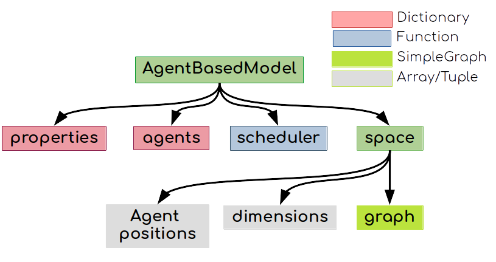

# Tutorial

Agents.jl is composed of components for building models, building and managing space structures, collecting data, running batch simulations, and data visualization.

Agents.jl structures simulations in three components: a _model_ component that keeps all model-level variables and data, an _agent_ component that keeps all agent-level variables and data, and a _space_ component that represents the space where the agents live.

For building any Agent-Based-Model (ABM), users have to define at least the following four quantities:

1. An [`AgentBasedModel`](@ref) instance.
1. A [`Space`](@ref) instance.  
1. A subtype of [`AbstractAgent`](@ref) for the agents.
1. A stepping function that controls how the agents and the model evolve.

With these, Agents.jl's tools manage the rest of the path to producing and processing data, as well as visualizations (Fig. 1).


-----



## 1. The model

```@docs
AgentBasedModel
```

## 2. The space

Under the hood, all spaces are represented by a graph from LightGraphs.jl.
However, if your space is a regular grid then there is some additional functionality that allows converting graph nodes to coordinates on the multidimensional grid.

Regardless, in every case you initialize your space by calling `Space`:

```@docs
Space
```

## 3. The agent

```@docs
AbstractAgent
```

The agent type **must** be mutable. Once an Agent is created it can be added to a model using e.g. [`add_agent!`](@ref).
Then, the agent can interact with the model and the space further by using
e.g. [`move_agent!`](@ref) or [`kill_agent!`](@ref).

For more functions visit the [API](@ref) page.

## 4. The stepping function

Any ABM model should have at least one and at most two step functions.
An _agent step function_ is always required.
Such an agent step function defines what happens to an agent when it activates.
Sometimes we also need a function that changes all agents at once, or changes a model property. In such cases, we can also provide a _model step function_.

An agent step function should only accept two arguments: first, an agent object, and second, a model object.

The model step function should accept only one argument, that is the model object.
To use only a model step function, users can use the built-in `dummystep` as the agent step function.

## 5. Running the model & collecting data

After the basic types and functions are defined, we can run the model using the built-in `step!` function. This will update the agents and the model as defined by the agent and model stepping functions.
In addition, by providing keywords to `step!`, it is also possible to collect and process data while the model evolves.

```@docs
Agents.step!
```

Notice that besides `step!`, there is also the [`paramscan`](@ref) function that performs data collection, while scanning ranges of the parameters of the model.

## An educative example
A simple, education-oriented example of using the basic Agents.jl API is given in [Schelling's segregation model](@ref). There the visualization aspect is also discussed.
